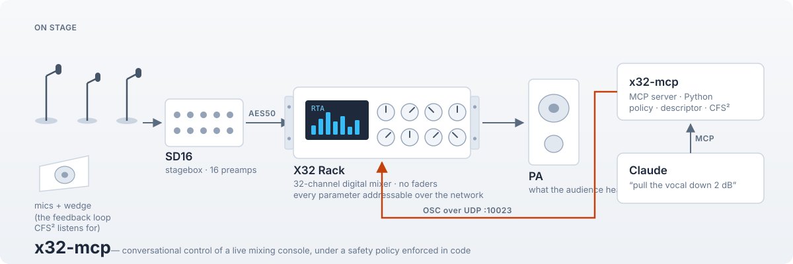
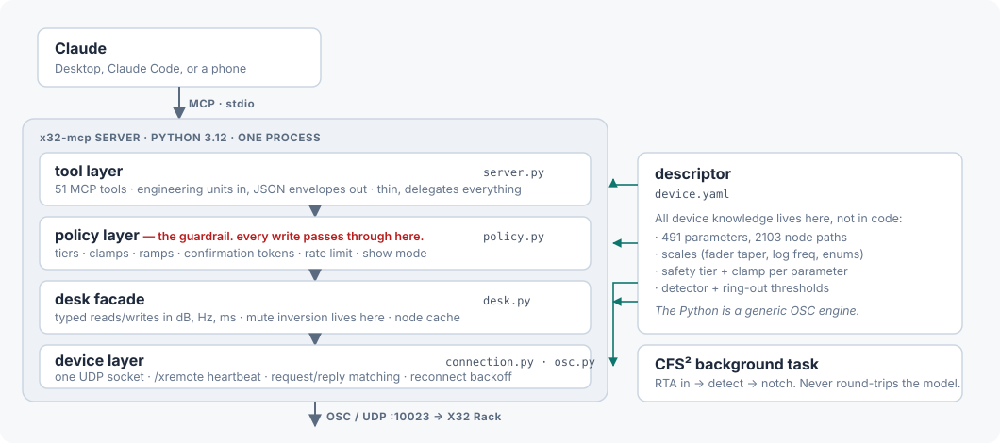
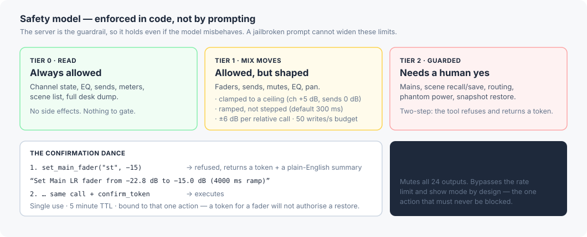
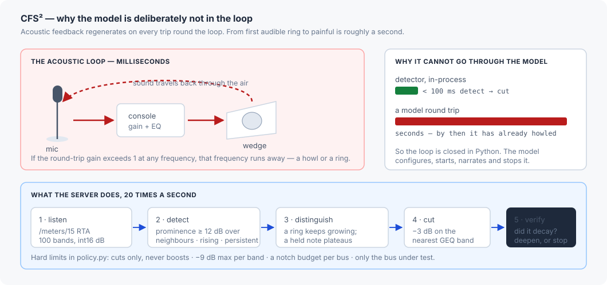

<p align="center">
  
</p>

# x32-mcp

An MCP server that lets Claude operate a **live sound mixing console** — safely enough to use at a
real gig, with the safety rules enforced in code rather than in a prompt.

It talks to a Behringer X32 Rack over the console's own network protocol, exposes 51 tools that
speak in decibels and channel numbers rather than raw floats, and refuses to do anything
dangerous without a human saying yes. On top of that sits **CFS²**, a feedback-suppression
assistant that closes a real-time control loop *inside the server*, because a language model is
three orders of magnitude too slow to sit in that loop.

It has been verified against real hardware, which found five defects that testing against a
simulator never would have. Those are written up in
[What real hardware taught us](#what-real-hardware-taught-us) — probably the most interesting
section here if you build agent tooling.

---

## Contents

**Start here if this domain is new to you**
· [If you don't work in audio](#if-you-dont-work-in-audio-start-here)
· [Why this is an interesting MCP problem](#why-this-is-an-interesting-mcp-problem)
· [Architecture](#architecture)
· [Safety model](#safety-model)
· [CFS² — the feedback problem](#cfs-feedback)
· [What real hardware taught us](#what-real-hardware-taught-us)

**Running it**
· [Requirements and install](#requirements-and-install)
· [The fake desk](#running-without-the-desk-the-fake-desk)
· [Hooking it up to Claude](#hooking-it-up-to-claude)
· [Environment variables](#environment-variables)
· [Dashboard](#dashboard)

**Reference**
· [Tool reference](#tool-reference) · [Safety model — reference](#safety-reference)
· [Snapshots and diffs](#snapshots-and-diffs) · [Patch plans](#patch-plans)
· [CFS² — operating reference](#cfs-reference)
· [Development](#development) · [Milestones](#milestones) · [Operational notes](#operational-notes)

**Other documents**
· [`docs/DESIGN.md`](docs/DESIGN.md) — the binding module contract every module was built against
· [`docs/BRIEF.md`](docs/BRIEF.md) — the original build brief
· [`docs/GIG_CHECKLIST.md`](docs/GIG_CHECKLIST.md) — pre-show routine, and the M5/M7 verification protocols
· [`docs/HANDOVER.md`](docs/HANDOVER.md) — state of the build, for whoever picks it up next
· [`docs/research/`](docs/research/) — the verified OSC protocol research

---

## If you don't work in audio, start here

Most of this README assumes you know what a mixing console does. Here is the whole domain in a
few paragraphs.

**What a mixing console is.** Microphones and instruments on stage produce electrical signals.
A console takes those inputs — 32 of them here — and for each one adjusts the level, shapes the
tone, and controls the dynamics. It then sums them into several different outputs at once:

- the **main** mix, which is what the audience hears through the PA speakers;
- several **monitor mixes**, one per performer, fed to wedge speakers on the floor or to in-ear
  monitors. The drummer and the singer want to hear very different things, so each monitor mix is
  an independent set of levels drawn from the same 32 inputs.

The signal path for one input is roughly **preamp gain → EQ → dynamics → fader → sent to the
outputs**. The vocabulary below maps onto that:

| Term | What it means |
|---|---|
| **channel** | One input. Channel 4 might be the lead vocal microphone. |
| **fader** | The level control for a channel or output, in **dB**. Named after the sliders on a traditional desk. |
| **bus** / **mix** | An output that inputs are summed into. Often a monitor mix for one performer. |
| **send** | How much of a given channel goes into a given bus. "More kick in Tony's ears" = raise the send from the kick-drum channel to Tony's monitor bus. |
| **preamp gain** | Analogue amplification applied before anything else. A microphone signal is tiny and needs roughly +45 dB before it is usable. |
| **mute** | Silence a channel or an output. |
| **scene** | A saved snapshot of the whole console, recalled between bands. |
| **RTA** | Real-time analyser — a live spectrum of what the console hears, in 100 frequency bands. |
| **feedback** | The howl when a microphone hears the speaker it is feeding. Explained [below](#cfs-feedback). |
| **FOH** | Front of house — where the engineer stands, mixing for the audience. |

**Why decibels matter.** dB is logarithmic: +10 dB is roughly twice as loud, −∞ dB is silence.
It is also not linear on the wire. The console stores a fader as a float from 0.0 to 1.0, mapped
to −∞…+10 dB by a four-segment piecewise curve. Every tool here speaks dB, and the raw floats
never escape the bottom two layers — getting that conversion slightly wrong makes every reported
level subtly false, so it is unit-tested against the console's own value table.

**The specific console.** The X32 Rack is a rack-mounted 32-channel digital mixer. Unlike a
traditional desk it has **no physical faders** — it is designed to be driven from software, a
tablet, or a separate control surface. An **SD16** stagebox sits on stage holding 16 more
microphone preamps, connected over a single cable (AES50). Every parameter in the console — 491
of them in our descriptor — is readable and writable over the network.

**Why this is risky.** A mixing console is a real-time, physical, public system:

- Mistakes are **instantly audible** to a room full of people, and are not undoable in any
  meaningful sense. You can put the fader back, but everyone already heard it.
- Some mistakes are **physically harmful**. Feedback at full level can damage hearing and destroy
  speaker drivers. Sending +48 V phantom power into the wrong microphone can wreck it.
- The operator is **busy**. At a gig the engineer has seconds, not minutes, and is often holding a
  tablet in one hand.

Irreversible, physical, time-critical, operated under pressure — that combination shapes every
design decision below.

---

## Why this is an interesting MCP problem

Most MCP servers read and write data. This one drives a physical device where a bad write is heard
by a hundred people. That changes several things.

**1. The model cannot be trusted with the limits, so the server holds them.** Every safety rule
lives in `policy.py` and every write passes through it. A jailbroken prompt, a confused model or a
runaway loop cannot widen a clamp, skip a confirmation or exceed the write budget. The tool
descriptions *explain* the rules; the server *enforces* them.

**2. Some loops are too fast for a model.** Acoustic feedback regenerates in milliseconds. Asking
a model what to do about it guarantees you are too late. CFS² therefore runs detect-and-cut as a
background task, and gives the model the roles it is genuinely good at: deciding whether to start,
explaining what is happening, and deciding when to stop.

**3. Confirmation has to fit a human conversation.** Guarded actions return a token that a second
call must present. We first gave those tokens a 60-second life — and during hardware testing one
expired while the operator was reading the prompt on his phone. The deeper hazard is what that
invites: *an agent that quietly re-mints an expired token has disabled the gate entirely.* The fix
was to make the TTL fit the human loop (5 minutes), not to teach the agent to work around it.

**4. Units are an interface, not a detail.** The model sees `-6.0 dB`, `1 kHz`, `Q 4.0`,
`channel 5`, `muted: true`. It never sees `0.6`, and never sees the inverted on/off convention the
wire actually uses (`mix/on = 0` means muted). Every ambiguity at that boundary is a chance for the
model to confidently report something false.

**5. The device is the source of truth.** The engineer is also touching the console — from a
control surface and the front panel — while the server is running. There is no shadow state beyond
a two-second read cache, invalidated by the console's own change notifications.

---

## Architecture

<p align="center">
  
</p>

The console speaks **OSC** (Open Sound Control — a simple binary format: an address such as
`/ch/01/mix/fader`, a type-tag string, and arguments) over **UDP port 10023**. Behringer never
published the protocol; it was reverse-engineered by Patrick-Gilles Maillot, and this
implementation is built from his C sources and verified against a real console. The research is in
[`docs/research/`](docs/research/) — about 4,200 lines, every numeric claim re-derived by a second
pass and tagged `VERIFIED` or `UNCONFIRMED`.

### Descriptor-driven — the MHS-shaped part

All device knowledge lives in [`device.yaml`](device.yaml), not in Python:

```yaml
ch:
  mix/fader:      {osc: f, scale: fader, node: db1,   tier: 1, clamp: {max: 5}}
  mix/on:         {osc: i, scale: bool,  node: onoff, tier: 1, inverted_mute: true}
  "eq/{band}/f":  {osc: f, scale: freq,  node: freq,  tier: 1}
```

Each parameter declares its wire type, its **scale** (how 0.0–1.0 maps to dB, Hz or an enum), how
the console prints it as text, its **safety tier** and its **clamp**. The Python is a generic OSC
read/write engine plus a policy enforcer; it has no idea what a channel is.

That separation is deliberate: it mirrors the Model Hardware Standard shape — standardised
read/write primitives plus a driver descriptor carrying the device's characteristics and safety
limits. A future MHS driver should be a re-packaging of `device.yaml` and the device layer rather
than a rewrite. It also makes the safety limits **data you can audit** instead of behaviour buried
in code.

| Module | Responsibility |
|---|---|
| `server.py` | 51 MCP tools. Thin — parse arguments, delegate, format the envelope. |
| `policy.py` | Tiers, clamps, ramps, confirmation tokens, rate limiting, show mode. |
| `desk.py` | Typed reads and writes in engineering units. Mute inversion lives here. |
| `connection.py`, `osc.py` | One UDP socket, heartbeat, request/reply matching, reconnect backoff. |
| `descriptor.py`, `scales.py` | `device.yaml` loader; value scaling including the fader taper. |
| `nodes.py` | The console's own text format: parse, render, snapshot, diff. |
| `meters.py`, `detector.py`, `cfs.py`, `provision.py` | CFS²: metering, detection, the ring-out state machine. |
| `webui.py` | Read-only dashboard. |
| `fakedesk.py` | A working console emulator, so the whole suite runs with no hardware. |

---

## Safety model

<p align="center">
  
</p>

Beyond the tiers, four mechanisms matter:

- **Ramps, not steps.** A level change interpolates over 300 ms by default — partly so it sounds
  like a mix move rather than a click, partly so a motorised fader *glides*, which matters when
  you are filming it.
- **Snapshot before the first write.** The first Tier-1 or Tier-2 write of a session automatically
  dumps the entire console to `snapshots/`. That is the undo button, and it costs 0.28 s.
- **`panic()` is Tier 1 on purpose.** It mutes all 24 outputs and is exempt from the rate limiter
  and from show mode. The one action that must never be blocked isn't. It also stops everything
  the server itself had in motion (fader ramps, a restore, a ring-out), latches the muted outputs
  so nothing re-opens them until the operator confirms `clear_panic`, and re-sends the mutes on
  reconnect if the desk was unreachable when it fired.
- **Show mode.** For mid-set use: tightens relative moves to ±3 dB and refuses scene recalls and
  ring-outs outright, token or no token.

---

<a id="cfs-feedback"></a>

## CFS² — the feedback problem

<p align="center">
  
</p>

**The problem.** A microphone feeds a speaker; the speaker's sound reaches the microphone; round it
goes again. If the round-trip gain exceeds 1 at any frequency, that frequency grows on every lap —
first a ring, then a howl, in about a second. It is the most common way live sound goes wrong, and
the standard remedy is to find the offending frequencies and cut them before the show: **ringing
out**.

**What CFS² does.** It subscribes to the console's RTA (100 bands, 20 frames a second), watches for
the signature of a regenerating loop — a *narrow* spectral line with *no harmonic family* (a note
carries partials at exact ratios that share its onset and envelope; a linear loop carries none),
*rock-steady in pitch* (vibrato, scoops and glides move; a room mode cannot), *sustained*, and then
one piece of positive evidence: the line was watched *growing* exponentially, it sits at the desk's
clip / an implausibly *loud* level, it was *already established* when the session armed, or it
*over-responds* to the server's own gain steps — and cuts that band on a graphic EQ. Growth is
evidence, never a requirement: a howl caught by a limiter plateaus like a held note, and low bands
"grow" on every bass onset because a 1/10-octave filter cannot settle faster than ~1/Δf. The full
design and its measured behaviour are in [`docs/DETECTOR.md`](docs/DETECTOR.md).

Three levels, each building on the last:

| Tool | Tier | Who drives the gain |
|---|---|---|
| `feedback_watch(bus)` | T1 | **You do.** The detector watches and notches. "I'm bringing up David's wedge — catch anything that rings." |
| `ring_out(bus)` | T2 | **The server does**, in 1 dB steps with a settling pause, notching as it goes, then backing off 3 dB for safety. |
| `ring_out_system()` | T2 | Every monitor bus in turn, then the mains, with one consolidated report. |

**Hard limits, in `policy.py`:** cuts only and never boosts · −9 dB maximum per band · a notch
budget per bus · only the bus under test · halt and restore the starting level if the console
disappears mid-run.

**A deliberate non-goal:** this is a *soundcheck* tool, not a mid-performance suppressor. During a
show that job belongs to the dedicated hardware in the rack, which reacts faster and fails safe.

---

## What real hardware taught us

Every module was built and tested against `fakedesk.py`, our own console emulator — **930 tests,
all green, no hardware required**. Then came the manual verification protocol against a real X32
Rack (firmware 4.13). **It found five defects the emulator could not have surfaced**, which is the
most transferable lesson here.

**1. Ambiguous nulls.** `fader_db` returned `null` both for "this fader is fully down" and for "we
could not read it". On the real console two strips were legitimately at −∞, so "is the vocal up?"
produced `null` — which a model can only report as *unknown*. Fixed by representing −∞ explicitly.
The same bug then turned up a second time in the CFS² layer.

**2. A rate limiter throttling itself.** Ramps emitted one step per 20 ms, which is exactly the
50 writes/second budget — no headroom, so the limiter stretched a 12-second ramp to 19.3 s. Worse,
a ramp saturated the write budget and would have crowded out a CFS² notch. Most of those writes
were no-ops anyway, because the console's fader grid is coarser than the ramp's steps. Skipping
unchanged values fixed the timing and freed the budget.

**3. A guard that blocked the main use case.** The ±6 dB "don't slam a level" rule was applied to
absolute moves as well as relative ones. On real hardware an unused send rests around −84 dB, so
*every* attempt to raise one was refused as a "+72 dB jump" — meaning "more kick in Tony's ears"
only worked if kick was already in Tony's ears. The guard now applies to relative moves, where a
typo actually does the damage.

**4. A confirmation TTL shorter than a conversation.** Described
[above](#why-this-is-an-interesting-mcp-problem).

**5. A routing assumption that was silently wrong.** Resolving "which physical preamp feeds this
channel?" assumed the classic routing blocks. This console uses firmware-4.x *user routing*, so
every channel resolved to *no preamp at all*. That broke phantom power — and would have broken
CFS² mic discovery, which decides what counts as a live microphone by asking whether a physical
preamp feeds it. On this console it would have classed the DJ's USB feeds as microphones and rung
out against them. It was caught only because a snapshot diff showed the operator's own preamp gain
sitting on a preamp the code insisted did not exist.

None of these were logic errors the tests could have caught, because each one was a wrong belief
about the world that the emulator faithfully reproduced.

---

## Requirements and install

- Windows 10/11 PC on the same LAN as the desk (a Wi-Fi tablet for the dashboard is optional).
- Python 3.12 managed by [uv](https://docs.astral.sh/uv/). The system `python` on this PC is
  3.8 and the Microsoft Store stub is on `PATH` — neither will do; always use the venv's
  interpreter by absolute path.
- Runtime dependencies (pure Python, pinned in `uv.lock`): `mcp` 2.x, `pyyaml`, `websockets` 17.

The exact commands used to set this repo up:

```powershell
# 1. uv (no admin rights needed)
powershell -ExecutionPolicy ByPass -c "irm https://astral.sh/uv/install.ps1 | iex"

# 2. a managed CPython 3.12
uv python install 3.12

# 3. the project venv (.venv) with runtime + dev dependencies
cd C:\Users\jim\Documents\claude\x32-mcp
uv sync
```

`uv sync` creates `.venv\Scripts\python.exe` and installs the `x32mcp` package (editable), the
`x32-mcp` and `x32-fakedesk` console scripts and the test tools. uv prints a harmless
"Missing expected target directory for Python minor version link" warning on this machine —
ignore it. Do not run `uv sync` while anything in the repo is being edited by build agents.

Launching the server by hand (it waits for an MCP client on stdin, so this is only useful for
a smoke test — `Ctrl-C` stops it):

```powershell
.venv\Scripts\python -m x32mcp.server        # or: python -m x32mcp, or: .venv\Scripts\x32-mcp
```

Logging goes to stderr (`X32MCP_LOG=DEBUG` for the wire level); stdout is reserved for MCP.

## Running without the desk: the fake desk

The repo ships its own Python X32 emulator, [`fakedesk.py`](src/x32mcp/fakedesk.py). It answers
`/info`, `/xinfo`, `/status`, GET/SET on every parameter in `device.yaml`, `/node` lines in the
console's padded text form, `/` node-style writes, `/xremote` pushes to up to four clients,
`/meters` subscriptions with the real little-endian blob layout (including a synthetic RTA on
`/meters/15`), scene recall/save/load, and a closed loop: the synthetic ring on the RTA is
attenuated by the GEQ inserted on the RTA-source bus, so a correct notch makes the ring decay.
Every integration test runs against it.

```powershell
uv run x32-fakedesk --port 10023                 # console script
.venv\Scripts\python -m x32mcp.fakedesk --port 10023
```

Options: `--host` (default `127.0.0.1`; `0.0.0.0` to serve the LAN for tablet demos), `--port`
(default 10023), `--name` (console name reported by `/xinfo`, default `X32-FAKE`),
`--scene-dir DIR` (persist `/save`d scenes as JSON), `--device-yaml PATH`, `--seed N` (synthetic
RTA seed), `--ring HZ` and `--ring-growth DB_PER_S` (start a feedback ring at boot, default
15 dB/s), `--log-level`. The fake ships four scene slots: 0 `Init`, 1 `The Molecules`,
2 `GravelAxe` (with different names and colours) and 3 `Empty` (no data). Fault injection for
tests: `/-fake/drop ,i n`, `/-fake/silence ,i 0|1`, `/-fake/latency ,i ms`, `/-fake/ring ,fi hz on`.

Then point the server at it: set `X32_HOST=127.0.0.1` (or call `connect("127.0.0.1")`), and
`discover_consoles()` also finds it — the fake answers broadcast `/xinfo` on loopback.

### About Maillot's X32 emulator

Patrick-Gilles Maillot publishes a Windows/macOS X32 emulator (`X32_windows.zip`) on his site,
<https://sites.google.com/site/patrickmaillot/x32>, with sources in
[`pmaillot/X32-Behringer`](https://github.com/pmaillot/X32-Behringer) (`X32.c`, v0.88, reports
firmware 4.06). What is known about it (verified from the C source; see
[`docs/research/mcp_sdk.md`](docs/research/mcp_sdk.md) §6 and
[`docs/research/transport.md`](docs/research/transport.md)): the UDP port is hard-coded to
10023 (no `-p`; `-i <ip>` picks the bind address, so run `X32.exe -i 127.0.0.1` locally), it
keeps up to four `/xremote` clients, its meter blobs are **zero-filled**, `/renew`,
`/batchsubscribe` and `/formatsubscribe` are **not implemented**, it has **no scenes**, it
persists state to `.X32res.rc` on `/shutdown`, and — a trap — `/-stat/lock ,i 2` also shuts it
down. It is fine for exercising the GET/SET/`/node` plumbing, but it cannot exercise meters,
CFS² or scene recall, which is why this repo ships its own fake desk. **Nothing needs
downloading** to develop or demo x32-mcp. If you do run against Maillot's emulator, keep
datagrams ≤ 512 bytes and expect no meter data.

## Hooking it up to Claude

Both hosts launch the server themselves over stdio; you never start it manually. Both ignore
any `cwd` field, so the config uses absolute paths and `X32MCP_HOME` tells the server where its
data directories live. Replace `<desk-ip>` with the X32's address (or leave `X32_HOST` out and
call `connect(host)` from the conversation — the server starts either way and only logs a
warning when autoconnect fails).

### Claude Desktop

Edit `%APPDATA%\Claude\claude_desktop_config.json` (Claude menu → Settings… → Developer → Edit
Config creates it), then fully quit and restart Claude Desktop:

```json
{
  "mcpServers": {
    "x32": {
      "command": "C:/Users/jim/Documents/claude/x32-mcp/.venv/Scripts/python.exe",
      "args": ["-m", "x32mcp.server"],
      "env": {
        "X32_HOST": "<desk-ip>",
        "X32MCP_HOME": "C:/Users/jim/Documents/claude/x32-mcp"
      }
    }
  }
}
```

The server's stderr (its log) lands in `%APPDATA%\Claude\logs\mcp-server-x32.log`; connection
problems are in `%APPDATA%\Claude\logs\mcp.log`. Claude Desktop starts servers with a
near-empty environment, so everything the server needs must be in `env` — that is why
`X32MCP_HOME` is spelled out rather than inherited.

### Claude Code

The project-scoped [`.mcp.json`](.mcp.json) at the repo root is checked in (Claude Code asks
you to approve it the first time):

```json
{
  "mcpServers": {
    "x32": {
      "type": "stdio",
      "command": "C:/Users/jim/Documents/claude/x32-mcp/.venv/Scripts/python.exe",
      "args": ["-m", "x32mcp.server"],
      "env": {
        "X32_HOST": "${X32_HOST:-}",
        "X32MCP_HOME": "C:/Users/jim/Documents/claude/x32-mcp"
      }
    }
  }
}
```

Claude Code expands `${X32_HOST:-}` from your shell environment (empty → no autoconnect, use
`connect`), so the checked-in file carries no IP; set `X32_HOST` before launching `claude`, or
edit the value in place. A private copy with the real address can live in `.mcp.local.json`
(gitignored) and be registered with `claude mcp add-json x32 '<json>' --scope local`.

Once connected, the model sees the server's instructions (`x32mcp.server.INSTRUCTIONS`): call
`connect` first, units, the target spellings, the tiers and the confirmation dance. Try:
*"connect to the desk and tell me what's on channel 5"*, *"pull Tony's vocal down 2 dB"*,
*"more kick in Tony's ears"* (a send), *"recall The Molecules scene"* (it will ask you to
confirm), *"kill it"* (panic).

## Environment variables

All read once at startup by [`config.py`](src/x32mcp/config.py) (`Settings.from_env`).

| Variable | Default | Meaning |
|---|---|---|
| `X32MCP_HOME` | repo root (parent of `src/`) | Base directory: `snapshots/`, `ringout_reports/`, `patches/`, `webui/` live under it |
| `X32MCP_DEVICE_YAML` | `<home>/device.yaml` | Descriptor to load |
| `X32_HOST` | *(unset)* | Desk IP/hostname; when set the server autoconnects at startup (a failure is logged, the server still starts) |
| `X32_PORT` | `10023` | Desk OSC port |
| `X32MCP_DASH` | `1` | `0`/`false`/`no`/`off` disables the dashboard |
| `X32MCP_DASH_HOST` | `0.0.0.0` | Dashboard bind address (`0.0.0.0` = reachable from the LAN) |
| `X32MCP_DASH_PORT` | `8032` | Dashboard HTTP/WebSocket port |
| `X32MCP_LOG` | `INFO` | Root log level on stderr (`DEBUG` shows every datagram) |

Data directories are created on startup if missing. `snapshots/` and `ringout_reports/` are
gitignored.

## Tool reference

Every tool returns a JSON envelope `{"ok": bool, "summary": str, ...}`. Single-object results
are merged into the envelope (`get_channel` → `{ok, summary, target, name, fader_db, muted, ...}`),
lists sit under a named key (`sends`, `scenes`, `snapshots`, `changes`, `reports`, `mics`,
`items`, `consoles`). Failures are `{"ok": false, "error": {"code", "message", ...details},
"summary"}` — tools never raise to the client. Levels are `*_db` floats (`"-oo"` when fully down, `null` only when *not read*)
with a text sibling (`fader`, `before`, `after`: `"-oo"`, `"-6.0"`, `"+2.0"`); −∞ is always
spelled `"-oo"` in JSON. A *target* is `ch.5`, `bus.3`, `main.st`, `main.m`, `dca.1`, `mtx.2`,
`auxin.1`, `fxrtn.1` (also `channel 5`, `5`, `aux 3`, `lr`, `mono`) or a strip name
(`"Vox Tony"`, unique case-insensitive match).

Tiers: **T0** read (always allowed) · **T1** mix move (clamped, ramped, rate-limited,
snapshot-before-first-write) · **T2** guarded (confirmation token, see the safety model).

### Phase 1 — connection and reads

| Tool | Tier | What it does |
|---|---|---|
| `discover_consoles(timeout_s=2.0, port=10023)` | T0 | Broadcast `/xinfo` on the LAN (and loopback) and list `[{host, port, name, model, firmware}]` |
| `connect(host, port=10023, confirm_token=None)` | T0 (T2 to switch to a different console while connected) | `/info` round trip, then heartbeat + watchdog; replaces any existing connection |
| `disconnect(confirm_token=None)` | T2 while connected | Close the connection (stops a CFS² session first) |
| `connection_status()` | T0 | State (disconnected/connecting/connected/degraded), console identity, RTT, show mode, CFS² mode, dashboard URL; `ok:false` with `NOT_CONNECTED`/`DEGRADED` |
| `get_channel(ch)` | T0 | Everything about input channel 1..32: name, colour, source, fader, mute, pan, preamp, EQ, comp, gate, insert |
| `get_bus(bus)` | T0 | Mix bus 1..16: name, fader, mute, 6-band EQ, comp, insert |
| `get_main()` | T0 | Main LR (`st`) and Main M/C (`m`) strips |
| `get_strip(target)` | T0 | Any strip by target or name; same fields as `get_channel` |
| `get_channel_sends(ch)` | T0 | The 16 bus sends of a channel `[{bus, bus_name, level_db, muted, pan, type}]` |
| `get_eq(target)` | T0 | `{on, bands: [{band, type, freq_hz, gain_db, q}]}` (4 bands on channels, 6 elsewhere) |
| `get_dynamics(target)` | T0 | Compressor (and gate on channels) in dB / ms / ratio tokens |
| `list_scenes()` | T0 | The 100 scene slots: stored scenes, empty slots, the current one |
| `get_current_scene()` | T0 | `{index, name, has_data}` of the loaded scene |
| `dump_desk_state(sections=None)` | T0 | Raw `/node` sections in engineering units; narrow with `['ch.5', 'bus', '/ch/05']`. The whole desk is ~2100 sections, so at most 200 come back (`truncated: true`, `section_count` has the real figure) — use `snapshot_desk` for the lot. Fields are the desk's own `/node` names, so `mix/on` is the wire convention (`true` = unmuted) |

### Phase 2 — Tier 1 mix moves

| Tool | Tier | What it does |
|---|---|---|
| `set_fader(target, db, ramp_ms=300, force=False)` | T1 | Fader to an absolute `db` (channels/aux/FX rtn/DCA cap +5 dB, buses/matrices 0 dB; ≤ −90 = −∞), ramped. The move size is not limited — the ceiling bounds it — so a fader can come up from silence directly; `force` is accepted but unnecessary |
| `adjust_fader(target, delta_db, ramp_ms=300, force=False)` | T1 | Relative move ("2 dB down" = −2) with the same clamps and limit |
| `mute(target)` / `unmute(target)` | T1 | Mute/unmute a channel, bus, matrix, DCA … (mains: `set_main_mute`) |
| `set_send(ch, bus, db=None, ramp_ms=300, force=False, on=None)` | T1 | Send from an input strip to bus 1..16: the level (cap 0 dB, ramped) and/or the send's on/off switch — give `db` and/or `on` |
| `adjust_send(ch, bus, delta_db, ramp_ms=300, force=False)` | T1 | "More kick in Tony's ears" = `adjust_send("Kick", tonys_bus, +2)` |
| `set_send_tap(ch, bus, tap)` | T1 | Tap point of a send: `IN/LC <-EQ EQ-> PRE POST GRP` (or `in`, `pre-eq`, `post-eq`, `pre`, `post`, `grp`, any case). The X32 keeps one tap per odd/even bus pair on the odd send, so bus 4 sets buses 3-4 — the summary names the pair. From a mix bus the sends go to matrices 1..6 (no `GRP`) |
| `set_main_assign(target, lr=, mono=, mono_level_db=)` | T1 | Main L/R assign, Main M/C assign and the M/C send level (cap 0 dB, ramped) of a channel, aux-in, FX return or bus; give at least one |
| `set_eq_band(target, band, freq_hz=, gain_db=, q=, type=, on=)` | T1 | One EQ band: 20..20 kHz, ±15 dB (clamped), Q 0.3..10, `LCut LShv PEQ VEQ HShv HCut`; `on` switches the whole EQ |
| `set_pan(target, pan)` | T1 | −100 (L) .. 0 .. +100 (R) |
| `set_comp(target, on=, threshold_db=, ratio=, attack_ms=, release_ms=, knee=, makeup_db=, mix_pct=)` | T1 | Compressor; only the values given are written; make-up gain clamped to `policy.dyn_makeup_max_db` (6 dB). Main LR/M-C EQ and dynamics are guarded (refused here — change them on the console) |
| `set_gate(target, on=, threshold_db=, range_db=, attack_ms=, hold_ms=, release_ms=)` | T1 | Channel gate; only the values given are written |
| `panic()` | T1 | **Emergency:** mute Main LR, Main M/C, all 16 buses and 6 matrices at once — no ramp, no confirmation, never blocked by show mode or the rate limiter; cancels the server's own ramps/restore/ring-out and latches the outputs |
| `clear_panic(confirm_token=None)` | T2 | After a panic: release the latch so the outputs can be unmuted/restored again (unmutes nothing itself) |

### Phases 2–3 — Tier 2 (confirmation token)

| Tool | Tier | What it does |
|---|---|---|
| `set_main_fader(which="st", db=-90, ramp_ms=300, confirm_token=None)` | T2 | Main LR / M/C fader (ceiling 0 dB), ramped |
| `set_main_mute(which, muted, confirm_token=None)` | T2 | Mute/unmute a main (for an emergency use `panic`) |
| `recall_scene(scene, confirm_token=None)` | T2 | Load a scene by index 0..99 or by (partial, case-insensitive) name; refused in show mode; result is verified by reading the current scene back |
| `save_scene(index, name, notes="", confirm_token=None)` | T2 | Save the desk into a slot (says whether it overwrites); refused in show mode |

### Phase 3 — snapshots and show mode

| Tool | Tier | What it does |
|---|---|---|
| `snapshot_desk(label="")` | T0 | Dump the whole desk to `snapshots/<YYYYMMDD-HHMMSS-label>.json` |
| `list_snapshots()` | T0 | Newest first `[{id, label, created, scene, size_kb, path}]` |
| `diff_snapshot(id="latest", scope=None)` | T0 | Plain-English differences between a snapshot and the desk now (≤ 200 changes, `count`, `truncated`) |
| `restore_snapshot(id, scope=None, confirm_token=None)` | T2 | Write a snapshot back (the undo); previews the changes on the first call; allowed in show mode |
| `show_mode(on, confirm_token=None)` | T0 / T2 to turn off | On: scene recall/save, `setup_ringout_eqs` and ring-outs refused, every fader/send move (absolute too) limited to ±3 dB unless forced; turning it off is confirmed |

### Phase 4 — labels, patch plans, routing

| Tool | Tier | What it does |
|---|---|---|
| `label_channel(ch, name=, color=, icon=)` | T1 | Name (≤ 12 chars), colour token or friendly name, icon 1..74 |
| `label_bus(bus, name=, color=, icon=)` | T1 | The same for mix bus 1..16 (`/bus/NN/config/*`) — "Tony IEM" on the scribble strip |
| `apply_patch_plan(file, include_source=False, confirm_token=None)` | T1 / T2 | Names and colours from a plan (T1, writes only what differs); `include_source=true` also patches input sources (T2) |
| `export_patch_plan(file)` | T0 | Write the desk's names/colours/sources to `patches/<file>.yaml|.csv`, keeping mic/owner/monitor_bus metadata of an existing file |
| `set_channel_config(ch, source=, link=, confirm_token=None)` | T2 | Input source (`IN05`, `AUX1`, `USBL`, `FX1L`, `BUS03`, `OFF`) and/or stereo link of the channel pair |

### Phase 5 — meters and CFS²

| Tool | Tier | What it does |
|---|---|---|
| `get_meters(type="channels", duration_ms=500)` | T0 | Averaged dBFS of `channels`, `buses`, `main`, `auxins`, `fxrtns` or `matrices` |
| `get_rta(target=None, frames=10)` | T0 / T1 | The console's 100-band RTA averaged over `frames`. Read-only without `target`; with one it first points the RTA at that strip, which writes the `/-prefs/rta/*` parameters (Tier 1: snapshot-before-write, rate limiter, `desk.write` event) and is refused while CFS² owns the RTA |
| `validate_ringout_eqs(buses)` | T0 | Read-only check that each bus (1..16 or `"main"`) has a usable, unshared, switched-on GEQ insert; step zero of any ring-out |
| `setup_ringout_eqs(buses, confirm_token=None)` | T2* | Provision dual-mono GEQ2s in free FX insert slots 5–8 (one slot serves two buses) and insert them; idempotent; *T2 only when something must change; refused in show mode |
| `discover_mics(bus, patch_file=None)` | T0 | Which channels feed the bus and look like live stage mics (unmuted, send ≥ −40 dB, physical preamp), cross-checked with the patch plan and mute group 6; `include` is a suggestion to confirm |
| `feedback_watch(bus, notch_budget=6, patch_file=None, lf_feedback_possible=False)` | T1 | Arm the detector; you raise the gain, the server cuts up to `notch_budget` notches; `lf_feedback_possible` for a kick / floor-tom mic into subs (window from 40 Hz instead of the open mics' HPF edge) |
| `feedback_watch_stop()` | T1 | Disarm / abort a running ring-out (backs the master off first) and save the report |
| `cfs_status()` | T0 | Mode, session, bus, master, budget left, candidate, stage, notches, the live alert list (`candidates`, `alert`) and the policy summary |
| `ring_out(bus, target_gain_db=None, step_db=1.0, dwell_ms=1500, notch_budget=6, patch_file=None, lf_feedback_possible=False, confirm_token=None)` | T2 | Automatic ring-out of one bus (see below); refused in show mode; the first call runs preflight and returns the plan |
| `ring_out_system(plan=None, confirm_token=None)` | T2 | Several buses, then Main LR, under one confirmation; without a plan every bus whose GEQ validates |
| `list_ringout_reports(bus=None)` | T0 | Saved reports, newest first |
| `get_ringout_report(id)` | T0 | One report in full (levels, notches, stages, detections) plus a Markdown rendering |

### Dashboard

| Tool | Tier | What it does |
|---|---|---|
| `dashboard_status()` | T0 | Whether the read-only dashboard runs, its URL, connected browsers, frame rate |

### Resources

`x32://device` (the descriptor, `text/yaml`), `x32://snapshot/latest` (newest snapshot JSON),
`x32://cfs/state` (CFS² state JSON), `x32://patches/{name}` (a patch plan, suffix optional).

### Error codes

`NOT_READY`, `NOT_CONNECTED`, `DEGRADED`, `CONNECT_FAILED`, `TIMEOUT`, `BAD_ARGUMENT`,
`NOT_SUPPORTED`, `GUARDED` (a Tier-1 tool aimed at a Tier-2 address), `UNKNOWN_TARGET`,
`AMBIGUOUS_NAME` (with `candidates`), `UNKNOWN_SCENE`, `AMBIGUOUS_SCENE`, `NOT_FOUND`
(snapshots, reports, patch files), `BAD_PATCH` (with `problems`), `BAD_TOKEN`, `TOKEN_EXPIRED`,
`RELATIVE_TOO_LARGE`, `SHOW_MODE_BLOCKS`, `RATE_LIMITED`, `PREFLIGHT_FAILED` (with
`preflight`), `BUSY`, `NO_STAGES`, `IO_ERROR`, `INTERNAL`.

<a id="safety-reference"></a>

## Safety model — reference

Enforced by [`policy.py`](src/x32mcp/policy.py) on every write path; the limits are the
`policy` block of `device.yaml`.

**Tier 0 — read.** Always allowed, including while the connection is degraded.

**Tier 1 — mix moves.** Faders, sends, mutes, pan, EQ, dynamics, labels, feedback watch.
- Clamps (reported, never silently applied): channel/aux/FX-return/DCA faders ≤ +5 dB, bus
  and matrix masters ≤ 0 dB, sends ≤ 0 dB, EQ gain ±15 dB. Anything below −90 dB is −∞.
- Relative limit: **`adjust_fader` / `adjust_send` only** — one call may move a level at most
  ±6 dB (±3 dB in show mode). The absolute `set_fader` / `set_send` are bounded by the ceiling
  above and by the ramp instead, so bringing a send up from −∞ to a working level does not need
  `force` (verified at M5 on the real desk: an unused send rests near −84 dB, and the old
  behaviour refused it as a "+72 dB jump"). A larger relative move
  is refused with `RELATIVE_TOO_LARGE` unless `force=true`, which the model is instructed to
  pass only when the user explicitly asked for a move of that size. Fades from/to −∞ are
  bounded by the clamp instead.
- Ramps: every level move is a glide (default 300 ms in 20 ms steps — smooth on the PA and the
  motorised faders glide on camera). A newer move on the same fader supersedes the older one.
- Rate limit: a 50 writes/s token bucket; a burst that would queue more than 1 s is refused
  with `RATE_LIMITED`.
- Guarded addresses (`guarded` globs in `device.yaml`: mains, phantom, routing, mute groups,
  inserts, FX types, sources, DCA/mute-group assignments, `/-action/*`, `/save`, `/load`) are
  refused by Tier-1 tools with `GUARDED` even if a target sneaks one in.

**Tier 2 — guarded.** `set_main_fader`, `set_main_mute`, `recall_scene`, `save_scene`,
`restore_snapshot`, `set_channel_config`, `apply_patch_plan(include_source=true)`,
`setup_ringout_eqs` (when it must change something), `ring_out`, `ring_out_system`. These use
the **confirmation dance**: the first call does nothing on the desk and returns

```json
{"ok": false, "requires_confirmation": true,
 "action_summary": "Recall scene 1 'The Molecules' (currently loaded: 0 'Init'); this replaces every setting on the desk",
 "confirm_token": "kQ7xR2mZ9aE", "expires_in_s": 300,
 "summary": "Confirmation required: … — show this to the user; if they agree, call recall_scene again with the same arguments and this confirm_token."}
```

The model shows the `action_summary`, and only after the user agrees calls the **same tool with
the same arguments** plus the token. Tokens are single-use, expire after 5 minutes and are bound to
the action *and* its normalised arguments — a token minted for scene 1 cannot recall scene 2
(`BAD_TOKEN`), and a stale one is `TOKEN_EXPIRED`. What that looks like in a conversation:

> **Jim:** recall the GravelAxe scene
>
> *Claude calls `recall_scene("GravelAxe")` → requires_confirmation*
>
> **Claude:** The desk is on scene 0 'Init'. Recalling scene 2 'GravelAxe' replaces every
> setting on the desk. The pre-recall state is in the auto snapshot. Go ahead?
>
> **Jim:** yes
>
> *Claude calls `recall_scene("GravelAxe", confirm_token="kQ7xR2mZ9aE")` → ok*
>
> **Claude:** Recalled scene 2 'GravelAxe' (verified; previous 0).

**Panic.** `panic()` writes 24 mutes (Main LR, Main M/C, bus 1–16, matrix 1–6) as
fire-and-forget SETs with no ramps, no snapshot and the rate limiter bypassed — Tier 1, never
blocked by show mode. Before the mutes leave it cancels every fader ramp the server was running,
and a `restore_snapshot` or CFS² session in flight aborts rather than re-open or re-raise what the
panic silenced (a panicked ring-out hands the bus master back no higher than it found it). While
the connection is degraded it still fires the datagrams, reports `delivered: "unconfirmed"`, and
sends them again the moment the desk answers. The muted outputs are **latched**: `unmute` and
`restore_snapshot` refuse them (`PANIC_LATCHED`) until the operator confirms `clear_panic` — which
unmutes nothing, it only lifts the latch — or re-opens a main through the confirmed
`set_main_mute`. What it silences is the 24 **mix masters** — everything tapped post-fader from a
bus, matrix or main. It does not touch feeds that bypass those masters: direct-out taps (P16 personal
monitors, record/broadcast splits), AES50/card outputs routed from input blocks, physical outs set to a
PRE/EQ tap, the monitor/phones bus and talkback. Know which of those your rig has. It is a backstop; the
reflex at a gig is X32-Edit or the physical mute (see [`docs/GIG_CHECKLIST.md`](docs/GIG_CHECKLIST.md)).

**Snapshot before write.** The first Tier-1/2 write of a session first dumps the whole desk to
`snapshots/<timestamp>-auto-pre-write.json` (a few seconds on a real desk; every later write is
immediate). `restore_snapshot` is the undo and is allowed even in show mode. `connection_status`
reports the id under `pre_write_snapshot`.

**Show mode.** `show_mode(true)` refuses scene recall/save, `setup_ringout_eqs` and both
ring-outs (`SHOW_MODE_BLOCKS`, checked *before* any token is consumed) and tightens the relative
limit to ±3 dB. `force` still bypasses the relative limit — show mode guards against accidents,
`force` expresses intent. Switch it on at doors, off for changeovers.

## Snapshots and diffs

A snapshot is the full `/node` sweep of the desk (about 2100 sections) in engineering units,
stored as `snapshots/<YYYYMMDD-HHMMSS[-label]>.json` with the console identity and the current
scene. `snapshot_desk("pre-show")` takes one deliberately; the first write of a session takes
`auto-pre-write`; a ring-out saves `ringout-pre-<bus>` (the bus's sections) before it starts.

`diff_snapshot(id, scope)` compares a snapshot with the desk now and returns English:

```
Ch 5 'Vox Tony' fader −4.2 dB → −1.0 dB
Bus 3 'Wedge A' send from Ch 2 'Snare Top' −20.0 dB → −17.0 dB (+3.0 dB)
Ch 12 'Keys R' muted → unmuted
```

`id` is `latest`, a full id or a unique prefix; `scope` narrows to a strip (`ch.5`), a family
(`bus`) or a path (`/ch/05`). `restore_snapshot` writes the differing sections back through
the console's own `/` node-style write (transport.md §6.6), one rate-limited line at a time,
awaiting each echo, and reports `written/lines`, `failed` and `duration_ms`. The first call
previews what would change and asks for confirmation. The newest snapshot is also the MCP
resource `x32://snapshot/latest`.

## Patch plans

A patch plan is one band's input list as data — channel, name, colour, source, and the facts
the desk cannot hold but CFS² needs: `mic` (a live stage microphone that can feed back),
`owner`, `monitor_bus`. YAML or CSV under [`patches/`](patches/);
[`patches/example_band.yaml`](patches/example_band.yaml) is a complete fictional example and
[`patches/README.md`](patches/README.md) documents the schema, the accepted spellings and the
apply/export semantics. `apply_patch_plan` writes names and colours that differ (re-applying is
free); input sources only with `include_source=true` (Tier 2). `export_patch_plan` round-trips
the desk back into the file while keeping the human-only columns. `discover_mics`,
`feedback_watch` and `ring_out` take `patch_file=` to cross-check the open-mic list.

<a id="cfs-reference"></a>

## CFS² — operating reference

**How it works.** The console's RTA (`/meters/15`: 100 log-spaced bands, 20 Hz–20 kHz, one
frame every 50 ms, values in dB) is pointed at the bus under test (`/-prefs/rta/source`, post-EQ,
verified through `/-stat/rtasource`). A pure-Python detector
([`detector.py`](src/x32mcp/detector.py), design and evidence in [`docs/DETECTOR.md`](docs/DETECTOR.md))
runs *inside the server* on every frame and decides with explicit physical predicates, each with its
own `device.yaml` threshold and a `reasons` string in the report:

- **BASE** = a narrow line (cluster prominence ≥ 12 dB, narrowness ≥ 8 dB) ∧ no co-moving harmonic
  family (H2..H5 at the exact 1/10-octave offsets) ∧ centroid stable over 5 frames (±30 cents)
  ∧ sustained ∧ new energy over the band's baseline (or present at arm) ∧ inside the session's
  frequency window (160 Hz watch / 63 Hz ring_out / lower when an LF feedback path is declared);
- **STRONG** = BASE ∧ one of: RISE (own rise ≥ 6 dB after the band's analyser settle time, net
  of common-mode gain moves), FAST-RISE (≥ 3 watched increments into a plateau, ≥ 15 dB), LOUD
  (clip flag, or above the arm-referenced loud line and 6 dB above everything else), AT-ARM (an
  established family-less line when the session armed; in ring_out only after the probe), PROBE
  (over-response to the server's own master steps in ring_out);
- **MODERATE** (BASE only) is published, never cut by the detector; a line that follows the gain
  steps 1 dB/dB is STATIONARY (a room source), and after each cut the detector verifies the band's
  response (`confirmed` / `insufficient` / `held` / `false_cut`) before any deepening.
- The **policy layer** in `cfs.py` ([`docs/CFS_POLICY.md`](docs/CFS_POLICY.md), knobs in the
  `cfs_policy:` block of `device.yaml`) acts on those hooks: it takes the feedback window's low
  edge from the open mics' high-pass filters (≈ 0.7 × the lowest HPF corner, 100 Hz without one,
  floored at 60; `lf_feedback_possible` opens it to 40 Hz), checks the ring-out's "stage is quiet"
  contract (`programme_present`) and says so in the report, gives a loud-ish MODERATE line **one**
  −3 dB cut (tier B, tagged in the report) and lets the detector's verdict decide the rest (held →
  alert and, only while still a held family-less line, −6/−9; false_cut → ignore-listed, the cut
  stays; a held line that is merely masked by a loud passage is not mistaken for one that ended),
  turns the bus's **scribble strip red** while a suspicious line it will not cut is live (always
  restored — on reconnect if need be), declines to cut a quiet line that was already sounding when a
  watch armed (alerted instead; its later deepening stays the policy's, not the detector's), never
  argues with the engineer's hands (a band released or a master pulled on the desk ends the policy's
  engagement), re-forces the RTA ballistics when the display looks frozen (and aborts if it stays
  frozen) and answers a stationary-but-suspicious line in a ring-out with a 3 dB back-off probe that
  yields the moment the detector files a real detection.

There is no weighted confidence sum and no absolute level gate (`confidence` is a monotone display
number ≥ 0.7 on emitted lines). A detection becomes
a −3 dB cut on the nearest band of a **31-band dual-mono GEQ (GEQ2)** inserted on that bus from
the FX rack (insert-only slots 5–8; one dual slot serves two buses via its L and R sides).
Re-detections deepen the same notch in −3 dB steps to −9 dB; adjacent-band detections merge;
each session has a **notch budget** (default 6). The policy allows **cuts only**, only on the
bus under test. All thresholds are the `detector`, `ringout`, `mics` and `cfs_policy` blocks of `device.yaml`.
The bus-PEQ fallback mentioned in the brief is not built — a bus without a GEQ insert fails
validation.

**Preflight** (`validate_ringout_eqs` + `discover_mics`, run automatically by every level):
the GEQ must exist, hold a GEQ/TEQ, be switched on and not shared with another strip; at least
one open mic must feed the bus; the bus master must be unmuted and not at −∞. Warnings: the
master starts above −10 dB, the patch plan and the desk disagree about a mic, the GEQ already
carries cuts. **Nothing is ever unmuted automatically**, and `include` on a mic candidate is a
suggestion the model must confirm with you.

**Mic discovery** (the open-loop problem — the desk does not know which channels are live mics)
uses three sources: desk state (unmuted, send to the bus ≥ −40 dB, a physical preamp behind the
channel source), the patch plan (`mic`, `owner`, `monitor_bus`) and the convention that **mute
group 6 = all stage mics**. Disagreements are listed per channel.

**The three levels.**

1. `feedback_watch(bus)` — Tier 1. Arms the detector; you bring the wedge up by hand (or walk
   the stage with the mic) and the server notches rings the instant they appear, up to the
   budget. A suspicious line it will not cut on the evidence (a quiet steady family-less line, a
   line that was already there when you armed, a cut that "held") turns the bus's scribble strip
   red on the console while it is live and is listed by `cfs_status`. `feedback_watch_stop()`
   disarms, gives the strip its colour back and writes the report.
2. `ring_out(bus)` — Tier 2, one confirmation that includes the open-mic list. A state machine
   (`PREFLIGHT → SNAPSHOT → ARM → RAISE → HOLD → NOTCH → VERIFY → … → BACKOFF → DONE`) raises the
   bus master in 1 dB steps with a 1.5 s dwell towards the target (default and hard ceiling
   0 dB). `step_db` must be between 0.1 dB (the fader report grid) and `ringout.max_step_db` (3 dB —
   a bigger step walks past the point where a ring declares itself), `dwell_ms` below `ringout.min_dwell_ms`
   (250 ms, the detector's persistence window) is raised to it with a warning, and a target at or below the
   current master is refused rather than run. On a detection
   it holds, notches, then **verifies** that the band drops ≥ 6 dB for two consecutive RTA frames
   within 1.5 s (else deepens; if it cannot deepen the run aborts and backs off 6 dB). It stops at
   the target or when the budget is spent, backs off 3 dB from the highest level reached — never
   below where it started, a run that raised nothing leaves the fader alone — and writes the
   report. Nobody may play or sing during the run. A lost connection restores the starting master
   level with raw retries (every 0.5 s for up to 10 s) and aborts; every back-off is forced, so
   even show mode's ±3 dB clamp cannot leave a bus hot.
3. `ring_out_system(plan)` — Tier 2, **one** confirmation for every wedge bus and then Main LR,
   with a consolidated report. `plan = {"stages": [{"bus": 3, "target_gain_db": -6, "mics": [1, 2]}, …, {"bus": "main"}]}`;
   without a plan every bus whose GEQ validates is rung out with defaults.

**Reports.** Every session writes `ringout_reports/<YYYYMMDD-HHMMSS-mode-bus03>.json` plus a
`.md` summary: start/peak/end master levels, every notch (band, Hz, depth, tier A = detector /
B = policy), the stages with timestamps, the detections, the detector's account (flags, measured
display release, arm-time level reference, every post-cut verdict), the policy log (LF edge and
where it came from, programme detected, every tier-B step with its verdict, alerts, at-arm lines
not cut, ignore-listed bands, back-off probes), warnings and whether it aborted. `list_ringout_reports` and
`get_ringout_report` read them back; `validate_ringout_eqs` reports which saved session a
bus's GEQ still matches (`matched_session`) so you can tell "rung out this afternoon" from
"someone reset the EQ".

**What the dashboard shows** during a session: the RTA bars, the waterfall with the ring as a
vertical streak before the detector trips, the notch markers with their depth on the RTA, the
state panel (mode, bus, master dB, budget left, candidate confidence meter, stage, connection)
and the event log (`cfs.stage`, `cfs.candidate` incl. alert on/off, `cfs.notch` with its tier,
`cfs.alert`, `cfs.policy`, `cfs.programme_present`, `cfs.abort`, `cfs.report`).

**Non-goal.** CFS² is a soundcheck / ring-out assistant. It is **not** a mid-set automatic
feedback suppressor: there is no "sentry mode", and show mode refuses ring-outs. If something
rings during the set the reflex is the fader, the mute or X32-Edit — not this server.

## Dashboard

A read-only web page served by the MCP server itself ([`webui.py`](src/x32mcp/webui.py),
[`webui/index.html`](webui/index.html) — vanilla JS + canvas, no build step): live RTA bars,
a waterfall (newest row at the bottom, ≈ 15 s of history), notch markers, the CFS² state panel
and a scrolling event log (last 200). Dark, high contrast, large elements, touch-tolerant, no
hover-only information. It never sends anything to the desk.

- URL: **`http://<pc-ip>:8032/`** (the PC's LAN address; `dashboard_status` and the startup log
  print it). `/healthz` returns JSON; the page's WebSocket is `/ws`. Frames are pushed at ≤ 20 fps.
- `http://<pc-ip>:8032/?demo=1` runs an in-page synthetic source (music, a ring at 2.4 kHz that
  gets notched, then one at 630 Hz) with no server at all — for filming and tablet layout
  checks. `python -m x32mcp.webui [--host] [--port]` serves the same demo from a standalone
  synthetic RTA with real WebSocket traffic.
- Disable with `X32MCP_DASH=0`; a port that cannot be bound is a warning, the MCP server
  still starts.

**Windows firewall.** Two things need letting through.

1. The dashboard listens on TCP 8032. Run once in an elevated PowerShell:

   ```powershell
   New-NetFirewallRule -DisplayName 'x32-mcp dashboard' -Direction Inbound -Protocol TCP -LocalPort 8032 -Action Allow
   ```

2. The OSC socket binds an **ephemeral UDP port** (the desk replies to whatever source port the
   request came from), so there is no fixed port to open. Windows shows its "allow this app on
   networks" prompt on the first run — **allow on Private networks** (the desk LAN should be
   a private profile). If the prompt was dismissed, or you want it tight, add an inbound UDP
   rule for the interpreter restricted to the desk's address. With a uv venv the socket belongs
   to the *base* interpreter (`.venv\Scripts\python.exe` is a launcher), so point the rule at it:

   ```powershell
   New-NetFirewallRule -DisplayName 'x32-mcp OSC' -Direction Inbound -Protocol UDP -Program 'C:\Users\jim\AppData\Roaming\uv\python\cpython-3.12.14-windows-x86_64-none\python.exe' -RemoteAddress <desk-ip> -Action Allow
   ```

   (`uv python dir` prints the managed-Python directory if the version differs; if the Windows
   prompt names a different `python.exe`, use that path.)

Gig setup: operator at FOH with an Android tablet running X32-Edit and the dashboard in a
browser tab; the Windows PC at the desk runs the server and the Claude client; instructions
are conversational, probably by voice from a phone. Emergency actions never go through the
conversational path.

## Termux (deferred)

The secondary target is an Android tablet running the server under Termux. The code keeps
that door open — pure-Python dependencies, no Windows-specific paths or APIs, every directory
relative to `X32MCP_HOME` — but it is **not built or tested** in v1, and native Termux is *not*
pure Python in practice: `mcp` needs `pydantic-core` (Rust), `rpds-py` (Rust) and
`cryptography`. Two routes (details and versions in
[`docs/research/mcp_sdk.md`](docs/research/mcp_sdk.md) §2):

1. **proot-distro** (recommended, all binary wheels): `pkg install proot-distro && proot-distro
   install ubuntu && proot-distro login ubuntu`, then `apt install python3 python3-venv`,
   `python3 -m venv ~/x32 && ~/x32/bin/pip install mcp pyyaml websockets` and run
   `python -m x32mcp.server` from a checkout. glibc means the manylinux aarch64 wheels install
   directly; UDP to the desk works inside proot.
2. **Native Termux**: `pkg install python python-pip rust binutils openssl python-cryptography
   python-rpds-py`, then build `maturin` and `pydantic-core` from source (~10 min, memory
   hungry), or use the community aarch64 `pydantic-core` wheel index noted in the research.

Survival settings for a tablet host: `termux-wake-lock` and exclude Termux from battery
optimisation (Android kills idle processes, which drops the `/xremote` heartbeat); keep Wi-Fi
on and on the desk's subnet (disable "switch to mobile data"); bind the dashboard to the
tablet's address (`X32MCP_DASH_HOST`); set `X32MCP_HOME` to a directory Termux can write; and
expect the desk's watchdog/DEGRADED handling to cover Wi-Fi hiccups. Whether Claude Desktop /
Code can launch a proot process as a stdio server is unconfirmed — the realistic Termux use is
the dashboard and CFS² with the MCP client elsewhere. Exposing the MCP server to the internet
is not supported.

## Development

```powershell
.venv\Scripts\python -m pytest                              # whole suite (unit + integration)
.venv\Scripts\python -m pytest tests\test_policy.py         # one module
.venv\Scripts\python -m pytest tests\integration            # everything against the fake desk
```

`pyproject.toml` already sets `-q`, `asyncio_mode=auto`, `pythonpath=src` and a 60 s
per-test timeout; passing `-q` again makes it `-qq`, which hides the pass/fail summary line.
Two connection tests are timing-sensitive under heavy CPU load. The integration fixtures
(`tests/integration/conftest.py`) start a `FakeDesk` on `127.0.0.1:0` per test with short
connection timeouts; `tests/integration/test_server_tools.py::make_app` shows how to drive
the tools as plain async functions without the MCP transport.

Layout:

```
device.yaml                  the descriptor (scales, enums, strips, params, nodes, guarded, policy, rta, geq, detector, ringout, mics, cfs_policy)
src/x32mcp/
  config.py events.py targets.py      settings, EventBus, Target parser
  osc.py scales.py descriptor.py      OSC codec, fader taper & scales, device.yaml loader
  connection.py nodes.py              X32Connection; /node parse/render, DeskState, snapshots, diff, restore plan
  policy.py desk.py                   safety policy; the Desk facade
  meters.py detector.py               meter blobs, FrameSources, SyntheticRta; FeedbackDetector + NotchController
  provision.py cfs.py patches.py      GEQ provisioning/mic discovery/preflight; CFS² sessions + policy layer + reports; patch plans
  cfs_policy.py                       the policy layer's knobs (cfs_policy:) and pure rules (LF edge, tier B, at-arm, alerts)
  webui.py fakedesk.py server.py      dashboard; X32 emulator; MCP tools + main()
webui/index.html             the dashboard page        patches/  plans + README
snapshots/ ringout_reports/  data (gitignored)         tests/ tests/integration/
docs/BRIEF.md                why (use cases, tiers, milestones)
docs/DESIGN.md               the binding module contract — implement exactly what it says; deviations are recorded in module docstrings
docs/research/               verified protocol ground truth (transport, scales/params, meters, FX/routing/scenes, MCP SDK/hosts)
docs/DETECTOR.md             the feedback discriminator: design, evidence, results; docs/CFS_POLICY.md  what cfs does with its hooks
docs/HANDOVER.md             how the build was driven; docs/GIG_CHECKLIST.md  operating + manual verification checklists
```

Conventions that must not drift: no `print()` under `src/x32mcp/`; only the three runtime
dependencies; engineering units at every public boundary (raw 0..1 floats never leave
`scales`/`descriptor`/`connection`/`nodes`/`fakedesk`); mutes are inverted on the wire
(`/…/mix/on` 1 = ON = unmuted) and translated in `desk.py` only; every network wait has a
timeout; policy is code, not prompt.

## Milestones

| | | Status |
|---|---|---|
| M1 | OSC codec + connection | done |
| M2 | Read surface, full desk dump | done |
| M3 | Policy + Tier-1 writes (tiers, clamps, ramps) | done |
| M4 | Scenes, snapshots, plain-English diffs | done |
| **M5** | **Real-desk verification** | **done — 11/11, see [What real hardware taught us](#what-real-hardware-taught-us)** |
| M6 | Meters + detector against synthetic RTA streams | done |
| M7 | CFS² in the studio, real mic and wedge | outstanding |
| M8 | Dashboard | done |
| M9 | Quality of life | mostly done |

M5 was run against an X32 Rack on firmware 4.13: full 2,103-section read in 0.28 s with nothing
unparsed, ramps verified gliding on a control surface, mute semantics confirmed the right way
round, guarded tokens 7/7, `panic()` at 0.4 ms with all 24 outputs verified muted, a faithful
snapshot/restore round trip, and automatic recovery 16.7 s after the network cable was pulled.

Still outstanding: **M7** (CFS² with a real microphone and wedge), scene recall (this console is
set to CUES rather than SCENES, so that needs flipping first), and a deliberate **power-cycle**
test — the cable pull proved the connection layer recovers, but not that console *state* survives
the PSU fault that prompted the requirement.

## Operational notes

- **PSU cutouts.** The desk has had intermittent (PSU-suspected) cutouts. When no datagram
  arrives for 12 s the watchdog probes `/info`; if that fails the connection goes **DEGRADED**:
  `connection_status` returns `ok:false` / `DEGRADED`, writes are refused with
  `NOT_CONNECTED` (reads still try — they are how it recovers), the dashboard shows the state,
  a running ring-out restores its starting master level and aborts, and a reconnect loop
  probes with 1, 2, 4, 8 s backoff until the desk answers again. No tool call ever hangs on it.
  Audio through the desk is unaffected by the server either way.
- **Power.** Keep the X32 on a wall socket; do not share a strip with the PC's switching loads.
- **Concurrent operators.** X32-Edit and the front panel may be used at the same time; the
  server's cache is 2 s and is invalidated by pushed updates, so reads reflect their changes.
  Guarded operations still only happen through the confirmation dance.
- **Clocks.** Snapshot and report ids are local timestamps; keep the PC's clock sane so
  `latest` means latest.
- **The fake desk is not the desk.** Several wire details are marked UNCONFIRMED in
  `docs/research/` (limited-broadcast `/xinfo`, single-leaf `/node` text, the `goscene` reply,
  FW 4.x column widths, name truncation). They are the point of M5.
